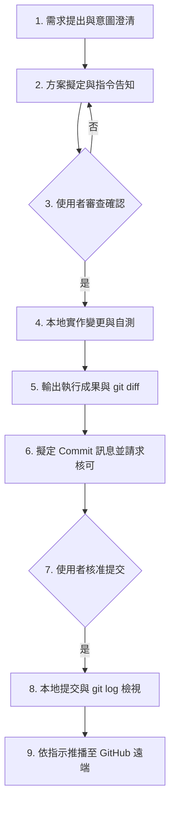

# WORKFLOW_GUIDE.md - 專案標準作業程序 (SOP)

本手冊規範 `hello-python` 專案在日常維護、功能擴充、版本控制與 AI 協同開發時之標準作業流程（SOP）。

---

## 1. 核心開發循環 (Core Development Loop)

本專案奉行「**最小可行步進（Small Steps）、審前揭露、雙重確認、差異透明**」的開發哲學：



---

## 2. 分步作業細則

### 步驟一：需求提出與意圖澄清
* 使用者發起功能需求（例如新增演算法、修改輸出格式）。
* AI 代理或開發者進行環境探測，評估對既有檔案的潛在影響。

### 步驟二：方案擬定與指令預告
* **規則**：凡涉及寫入硬碟、修改設定、執行外部套件安裝之指令，**必須在執行前明確條列**。
* 條列內容需包含：
  1. 完整 Shell 指令字串。
  2. 該指令對專案或系統造成的具體影響。
  3. 後續串聯的下一步驟。

### 步驟三：審查確認機制
* 等待使用者於終端機或聊天介面明確回覆授權關鍵字（如「同意」、「好」）。
* 未獲確認前，嚴禁自動批量修改。

### 步驟四：程式碼撰寫與本機驗證
* 優先遵循 `src-layout` 模組化規範，核心計算放於 `src/hello_python/core.py`。
* 執行測試指令確保無語法或邏輯錯誤：
  ```bash
  python3 hello.py
  # 或使用測試套件
  python3 -m unittest discover tests
  # 執行專案標準合規審計
  python3 audit_project.py
  ```

### 步驟五：版本差異（Diff）檢視與白話解讀
* 執行 `git diff` 輸出檔案改動。
* 主動解說改動重點：
  - **綠色加號 (`+`)**：說明新加入了哪些函式、常數或功能邏輯。
  - **紅色減號 (`-`)**：說明哪些舊寫法被移除或重構，並說明替換的原因。

### 步驟六：提交訊息規範 (Commit Convention)
* 本專案統一採用「**里程碑版本編號：明確動作敘述**」之 Commit 格式：
  - 格式範例：`v1：第一版`
  - 格式範例：`v2：新增印出今日日期`
  - 格式範例：`v3：新增依今日日期（dd）列印巴斯卡三角形功能`
  - 格式範例：`v4：專案工程化升級與對話文檔溯源庫`
* 提交前需擬定好文字給使用者確認。

### 步驟七：本地提交與狀態對齊
* 執行指令：
  ```bash
  git add <檔案>
  git commit -m "<確認之訊息>"
  git log -n 3 --oneline
  ```

### 步驟八：遠端同步與驗證 (Remote Push)
* 僅在使用者明確要求推播時執行：
  ```bash
  git push origin main
  ```
* 推送後必須執行狀態校驗指令：
  ```bash
  git log --oneline
  git status --short --branch
  ```
* 確保本地分支顯示 `## main...origin/main` 且無任何落後或未提交之暫存檔案。

---

## 3. 隱私與資安規範

1. **嚴禁提交敏感資訊**：密碼、私密金鑰（API Keys）、個人真實姓名及學校 Email 絕對不得納入版本控制。
2. **Git 作者防護**：本儲存庫強制綁定 local 作者資訊：
   ```bash
   git config --local user.name "chinkunlim"
   git config --local user.email "chinkunlim@users.noreply.github.com"
   ```
3. **敏感檔案排除**：`.env`、`.venv`、IDE 快取檔均已由 `.gitignore` 自動排除。
