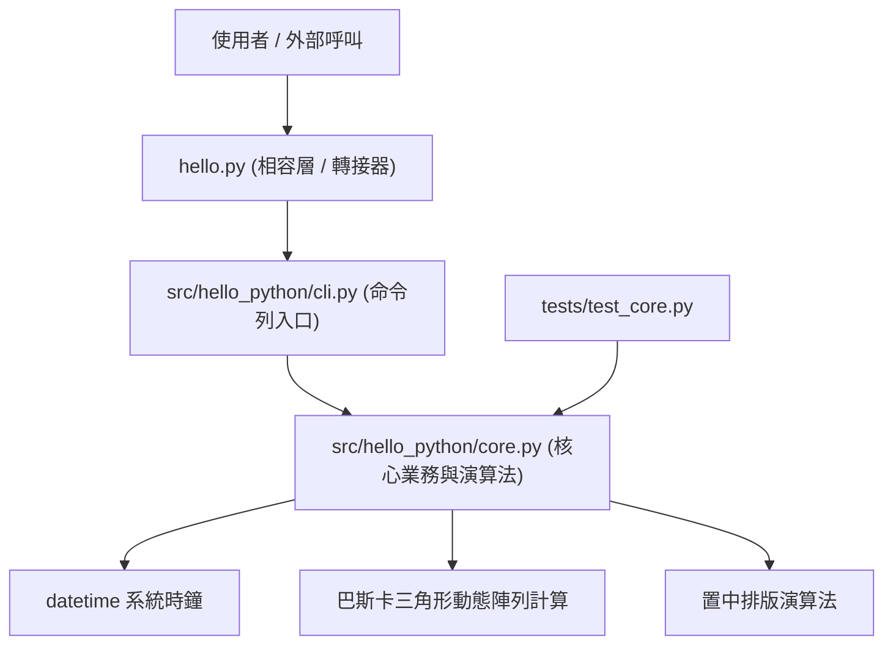

# ARCHITECTURE.md - 系統架構設計

本文件詳細闡明 `hello-python` 在 v4.0.0 階段之架構劃分、分層職責與呼叫流程。

---

## 1. 架構全景 (Architecture Overview)

專案採現代 Python 標準之 **src-layout** 設計，徹底隔離封裝邏輯與執行入口：

---

## 2. 模組職責定義

| 模組檔案 | 類型 | 核心職責 |
| :--- | :--- | :--- |
| `hello.py` | 頂層相容入口 | 將 `src` 注入 `sys.path` 並轉發呼叫 `cli.main()`，保留向後相容。 |
| `src/hello_python/cli.py` | 表現層 (Presentation) | 處理終端機 I/O 互動，依序調用 core 函式並輸出至標準輸出。 |
| `src/hello_python/core.py` | 領域層 (Domain Core) | 純函式（Pure Functions），負責字串組裝、日期取得、三角形遞迴計算與排版。 |
| `tests/test_core.py` | 驗證層 (Verification) | 使用標準 `unittest` 對核心領域函式進行 100% 邊界與邏輯覆蓋測試。 |

---

## 3. 演算法複雜度說明
* **巴斯卡三角形生成**：
  - 時間複雜度：$\mathcal{O}(N^2)$，其中 $N$ 為天數（$1 \le N \le 31$）。
  - 空間複雜度：$\mathcal{O}(N^2)$，保留歷史階層數字矩陣以供置中對齊印出。
